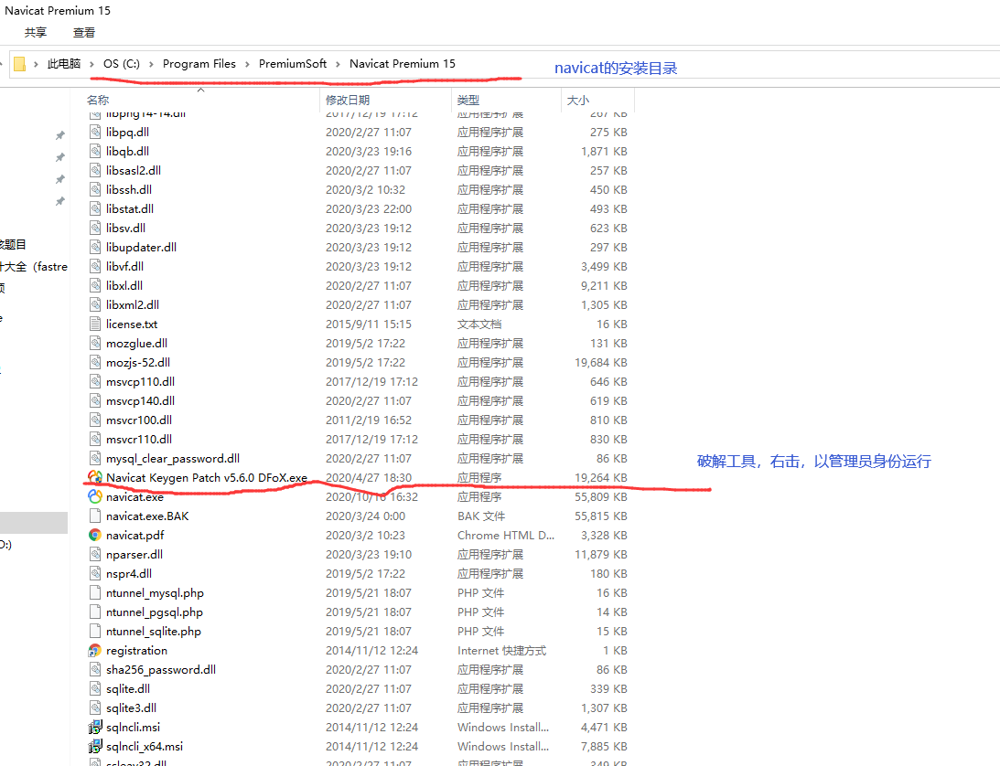

# [Navicat Premium15破解教程](https://www.cnblogs.com/yunwangjun-python-520/p/13827824.html)

# 第一步：安装前的准备步骤：

## 1.1、下载navicat和激活工具

链接: https://pan.baidu.com/s/1S1MfQcGg1qimOFCOTTkx_w

提取码: fgib

 

## 1.2、关闭所有的杀毒软件（很重要的步骤）

 

## 1.3、如果之前装过navicat,必须彻底删除navicat的残留文件。

- 卸载  点开windows设置，选择应用，找道navicat，点击选择卸载。

- *为了安全起见，记得去 我的电脑里把文件夹删除，如果你是默认安装的路径，那么就在 C:\Program Files\PremiumSoft 下，

  *

- *如果不是默认的，就去找你当时安装的路径，删除 Navicat Premium ，这个文件夹或者是你当初另外命名的文件夹

  
  *

- *删除注册表   win+r 输入 "regedit"，回车*  

- *在里面找到 HKEY_CURRENT_USER\Software\PremiumSoft 这个路径下的 Navicat 的相关注册表 删除(我是有几个删几个，从不慌)，

  
  *

# *第二步：开始安装*

## *2.1安装\*Navicat Premium15**

**

 

 

 

**然后一直傻瓜式操作就行，注意看一下自己的安装目录**

 

 

## **2.2利用注册机激活Navicat Premium15**

 

 

 

 

　　如果你是默认安装的话，你的navicat的安装路径是在C:\Program Files\PremiumSoft\Navicat Premium 15，

然后将上述图片中的破解工具复制到C:\Program Files\PremiumSoft\Navicat Premium 15。

如果不是默认安装，就把破解工具放到你自定义的navicat的安装目录下

 

 

 

 

### 2.3点击patch

 

 

 

 

 

### 2.4等待出现navicat.exe -x64-> Cracked!

 

 

 

### 2.5点击Generate

**

 

 

 

### 2.6打开Navicat Premium 15，点击注册

 

 

### 2.7粘贴秘钥，然后点击**激活**按钮

### **

 

 

 

### 2.8在弹出的界面选择手动激活

###  

 

###  ***2.9将请求码粘贴到注册机Request Code框中（完整过程看图）***

###  

 

 

 

 

 

### 2.10点击激活页面的激活弹出（说明激活成功）

###  

 

 

 

 

 

 

 到此navicat15安装和破解成功

 